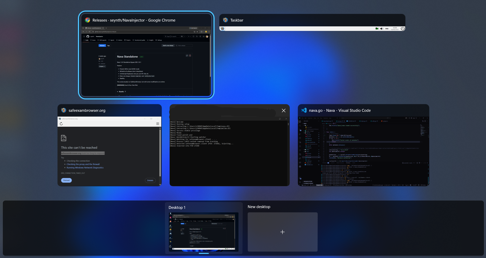

# Nava
Nava work against SEB 3.10.1

Simple fork that prevent SEB from killing explorer.exe at start and add ci/cd builds each commit

The goal of this script is to prevent SEB to start new obfuscated desktop and put in KIOSK mode. My method is to patch all necessary function with Harmony C#. You can see all that function inside `NavaInjector/Milim/patch`

<p align="center">
  
</p>

## Quick Usage

Make sure to turn off Real-time Protection windows defender

First download [Release zip](https://github.com/SadHilarious/NavaInjector/releases), extract then run ``nava_standalone.exe`` as Administrator 

Wait until it say `[Nava] Ready`, then you can start your Safe Exam Browser by double click .seb file or from exercise/quiz provider. Dont close your terminal!

Hiding Taskbar can be done by go to Taskbar settings > Taskbar behaviors > Automatically hide the taskbar 

> [WARNING]
> Always close your SEB with bottom right power button on the taskbar provided by SEB.

- Support original author<br>
[](https://ko-fi.com/F1F611FQO4)

## Build from scratch

### Requirement
- [golang](https://go.dev/dl/) >= 1.24.1
- [dotnet sdk](https://dotnet.microsoft.com/en-us/download)


## Step 1 - Build the runner (Nava.dll)

Nava.dll is a payload that have `init()` function, this function act like DllMain. Init function executed automatically after injector inject this Nava.dll to both SafeExamBrowser.exe and SafeExamBrowser.Client.exe. The purpose of this dll to manipulate .NET CLR to call some function i've patched using Harmony C#. That's why this script will not change browser-exam-key and config-key-hash

```bash
git clone https://github.com/seynth/NavaInjector
cd NavaInjector\Nava
go build -o nava.dll --buildmode=c-shared
```


## Step 2 - Build the payload (Milim.dll)

Milim.dll is a Harmony C# project that have all necessary modified function of Safe Exam Browser, when Milim.dll injected to parent and client process it will do the work like preventing to make obfuscated desktop, whitelisted all blacklisted software, unintercepted the keyboard, and more.

```bash
cd ..\Milim
dotnet build -c Debug -p:Platform=x64
```


## Step 3 - Build the injector

The injector is entry point of this project. I embed Nava.dll and Milim.dll to this executable to make it standalone executable.
Make sure to turn off Real-time Protection windows defender before build the executable

```bash
cd ..\injector
copy ..\Milim\bin\x64\Debug\Milim.dll .\
copy ..\Nava\nava.dll .\
go build -o nava_standalone.exe
# To build without a terminal window appearing, please use this command
go build -ldflags="-H windowsgui" -o nava_standalone.exe
```
Since there is no visible console output, please allow 30-60 seconds for Nava to initialize. When you're done you can kill Nava by opening Task Manager > Search nava_standalone > Right Click > End Task

## Step 4
Or just run [build.yml](./.github/workflows/build.yml) inside ``Actions`` tab

